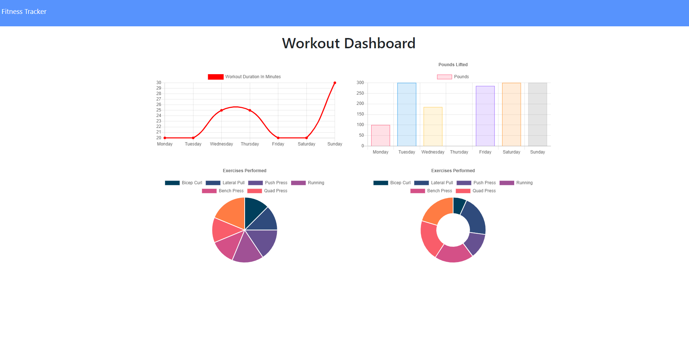
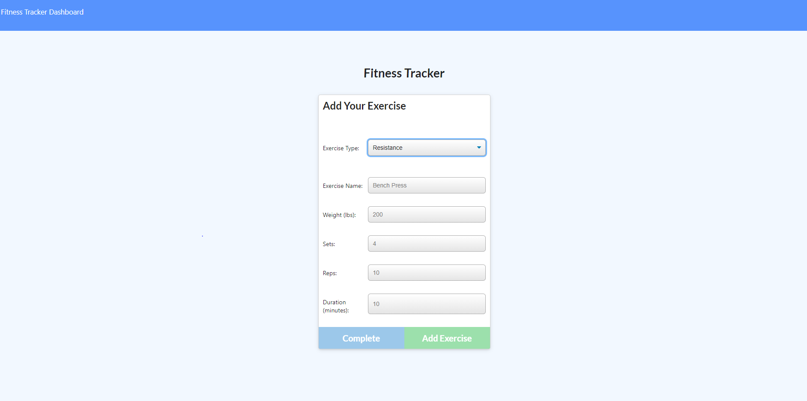

# Workout Tracker
  
  
## Description 
  
Workout tracker is an application where user can log their workout routines. After logged data , info then use to generate into graph for farther review.


## Table of Contents

* [Installation](#Installation)
* [Usage](#Usage) 
* [Contributing](#Contributing)
* [License](#License)
* [Questions](#Questions)
  

## Installation 
  
Please run the following command to install required software:

```
npm install
npm start
```


## Usage

These are the technologies and languages use for this project: MongoDB , node js , express, mongoose 

Deployed Heroku Link:   https://vkh-workout-tracker.herokuapp.com/

Github Repository Link: https://github.com/vinhkhamhuynh/workout-tracker
  



  
   
## License 
  


 
This project is licensed under the MIT license. For more information, click here: https://spdx.org/licenses/MIT.html 
 


## Questions
  
Please follow me on Github for more projects: [vinhkhamhuynh](https://github.com/vinhkhamhuynh) 

For any questions or to report issues, please email me at: vinhkhamhuynh@gmail.com
  

